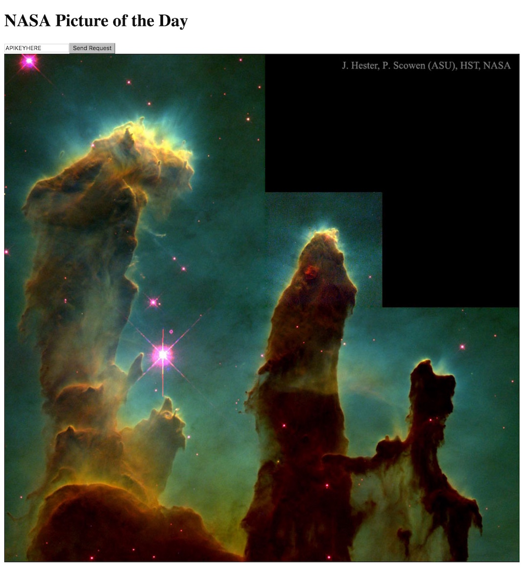

# Reflex examples

For these examples you will need to install reflex-platform.

```
$ git clone git@github.com:reflex-frp/reflex-platform.git
$ ./try-reflex
```

Once you're in the nix shell, you can run the command `ghcjs file.hs` as it'll compile the haskell code into a single page application.

---
## Examples

1. NASA Picture of the Day api client
2. ?


### 1. nasa-pod.hs

You'll need to get an API key first, from [https://api.nasa.gov](https://api.nasa.gov). Then with this key you can enter it into the textbox in the compiled gui. This example is also available at [reflex-examples](https://github.com/reflex-frp/reflex-examples/blob/master/nasa-pod/workshop.hs).



---

### 2. ?